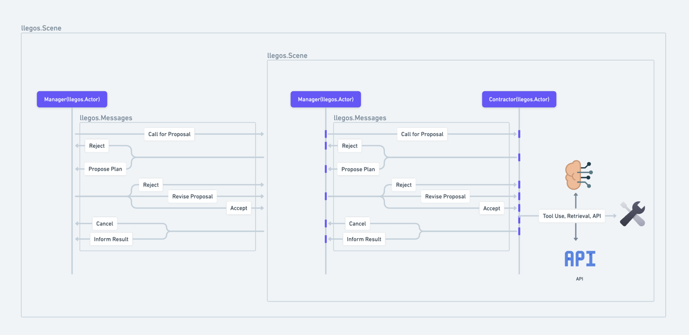
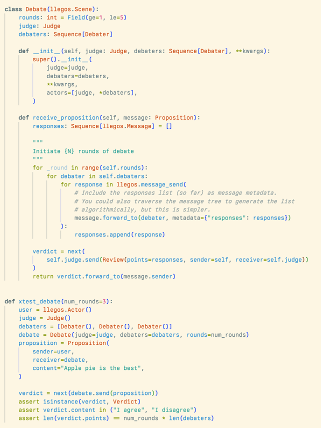

**Tweet 1**
We're thrilled to announce the alpha release of Llegos, a domain specific library for designing multi-agent systems in Python led by @CyrusofEden.

Llegos in a nutshell: llegos.Actors are containers for your agents, and llegos.Actors send llegos.Messages and share llegos.Objects in llegos.Networks.

Described by an early contributor as "More of a PyTorch, less of a Keras"

**Tweet 2**
Let's dive into what makes Llegos a game-changer.

First, Strongly Typed Message Passing - ensuring clarity and precision in communication between your agents. Llegos focuses on making complex interactions simpler and more reliable.

**Tweet 4**

Next, Email-like Messaging Semantics. Messages in Llegos are as intuitive as using email - with functionalities like replying and forwarding.

**Tweet 5**
Bring Your Own Libraries. Llegos seamlessly integrates with tools like Langchain, LlamaIndex, Outlines, DSPy...modularity is vital.
Enhance your agents and coordinate them in a multi-agent system with ease.

**Tweet 6**
Flexibility and generalizability are at the core of Llegos. The core primitives allow you to model agent hierarchies, networks, and more.

**Tweet 7**

Jump into the GitHub repo to start exploring. We're excited to see what incredible systems the community will create wih Llegos. Let's build the future together.

https://github.com/CyrusOfEden/llegos

**Tweet 8**
Stay tuned for updates, new features, and more as we continue this exciting journey. Come join us in our [Discord](https://discord.gg/jqVphNsB4H) to collaborate on multi-agent systems.
