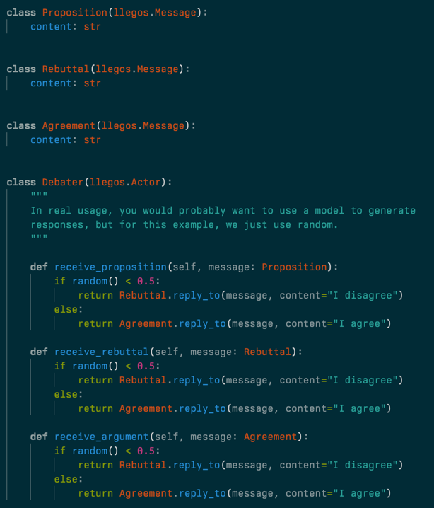
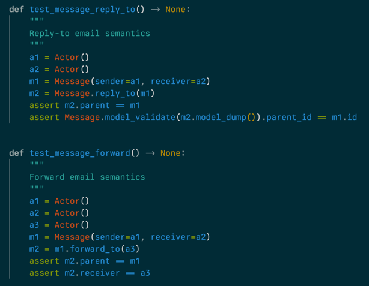
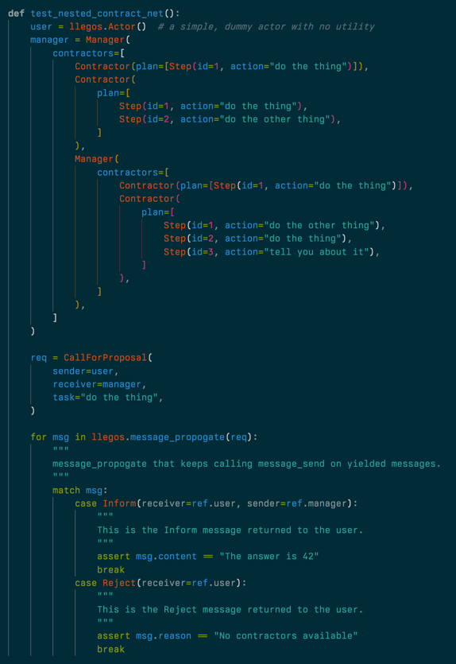

**Tweet 1**
🚀 Big news! We're thrilled to unveil the alpha release of Llegos, a groundbreaking Python DSL for designing multi-agent systems. It's a whole new way to build and interact with these systems.

**Tweet 2**
Let's dive into what makes Llegos a game-changer.

First up, Strongly Typed Message Passing - ensuring clarity and precision in communication between your agents. It's all about making complex interactions simpler and more reliable.

**Tweet 3**

Next, we've got Email-like Messaging Semantics. This means your messages in Llegos are as intuitive as using email - with functionalities like replying and forwarding. Who knew agent communication could be this straightforward?

**Tweet 4**
Here's a big one: Bring Your Own Libraries. Llegos seamlessly integrates with tools like Langchain, LlamaIndex, Outlines, DSPy... You name it! Enhance your agents and coordinate them in a multi-agent system with ease.

**Tweet 5**
Flexibility and generalizability are at the core of Llegos. The core primitives allow you to model agent hierarchies, networks, and more. It's a whole new way to think about multi-agent systems.

**Tweet 6**
Shoutout to @CyrusOfEden, the brain behind Llegos! His expertise in multi-agent systems has been instrumental in bringing this project to life. We can't wait for you to explore what he's created.

**Tweet 7**
Read our full launch post here:

[LINK TO BLOG POST]

**Tweet 9**

Ready to get started with Llegos? jump into our GitHub repo to start exploring. We're excited to see what incredible systems you'll create!

https://github.com/nousresearch/llegos

**Tweet 8**
And we're just getting started. Join us to shape its future – your ideas, feedback, and contributions are what will drive Llegos forward. Let's build something amazing together!

We're particularly excited to see what you create with Llegos. Come join us in our [Discord](https://discord.gg/jqVphNsB4H), and let's build the future of multi-agent systems together!

**Tweet 9**
The future of Llegos is bright, and with your input, it'll only get brighter. Stay tuned for updates, new features, and more as we continue this exciting journey. The best is yet to come!
