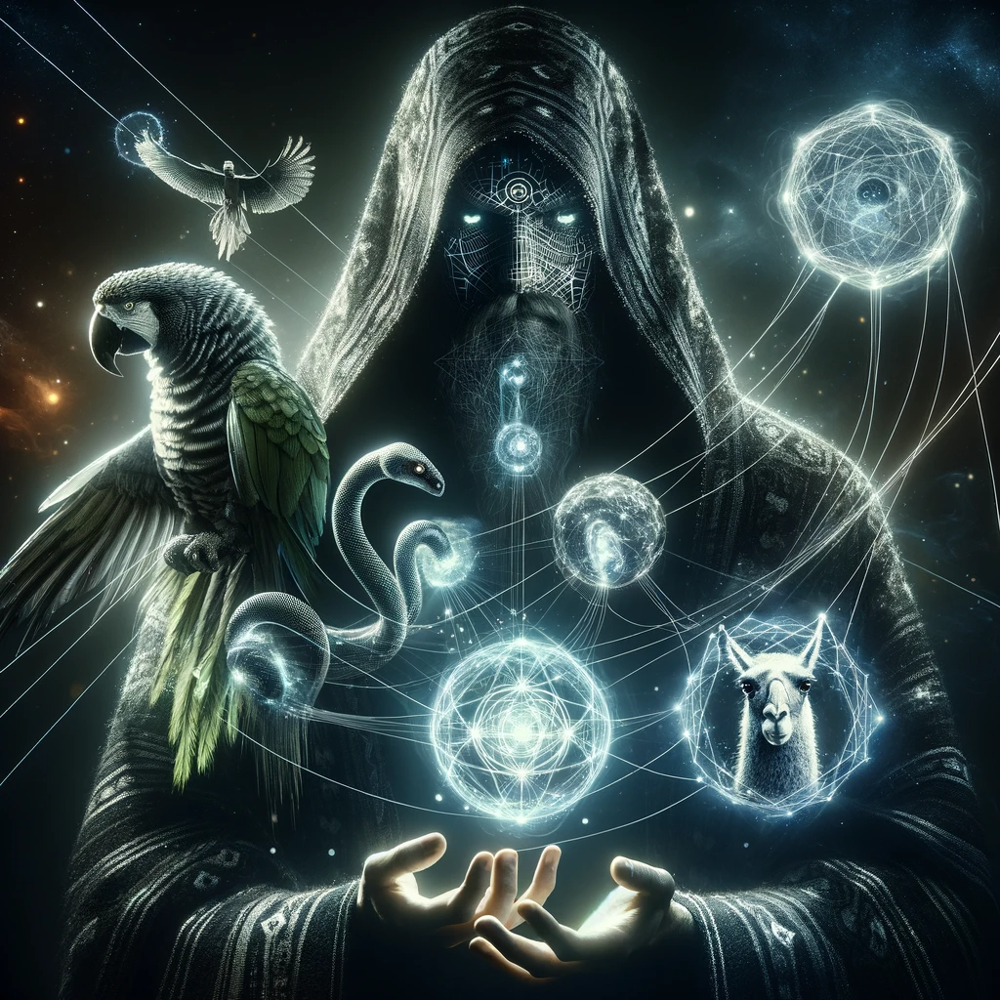

**Tweet 1**
🚀 Big news! We're thrilled to unveil the alpha release of Llegos, a groundbreaking Python DSL for designing multi-agent systems. It's a whole new way to build and interact with these systems.

"More of a PyTorch, less of a Keras"

**Tweet 2**
Here's Llegos in a nutshell: llegos.Actors are containers for your agents, and llegos.Actors send llegos.Messages and share llegos.Objects in llegos.Scenes.

Here's @CyrusOfEden, the man behind Llegos, and @karan4d, cofounder of Nous, to tell you more about it.

!!!!! INTRO VIDEO !!!!!

**Tweet 3**
Let's dive into what makes Llegos a game-changer.

First up, Strongly Typed Message Passing - ensuring clarity and precision in communication between your agents. It's all about making complex interactions simpler and more reliable.

**Tweet 4**

Next, we've got Email-like Messaging Semantics. This means your messages in Llegos are as intuitive as using email - with functionalities like replying and forwarding. Who knew agent communication could be this straightforward?

**Tweet 5**
Here's a big one: Bring Your Own Libraries. Llegos seamlessly integrates with tools like Langchain, LlamaIndex, Outlines, DSPy... You name it! Enhance your agents and coordinate them in a multi-agent system with ease.

**Tweet 6**
Flexibility and generalizability are at the core of Llegos. The core primitives allow you to model agent hierarchies, networks, and more. It's a whole new way to think about multi-agent systems.

**Tweet 7**
Read our full launch post here:

[LINK TO BLOG POST]

**Tweet 9**
Ready to get started with Llegos? jump into our GitHub repo to start exploring. We're excited to see what incredible systems you'll create! Let's build the future together.

https://github.com/nousresearch/llegos

**Tweet 8**
The future of Llegos is bright, and with your input, it'll only get brighter. Stay tuned for updates, new features, and more as we continue this exciting journey. The best is yet to come! Come join us in our [Discord](https://discord.gg/jqVphNsB4H) to jam on multi-agent systems.
